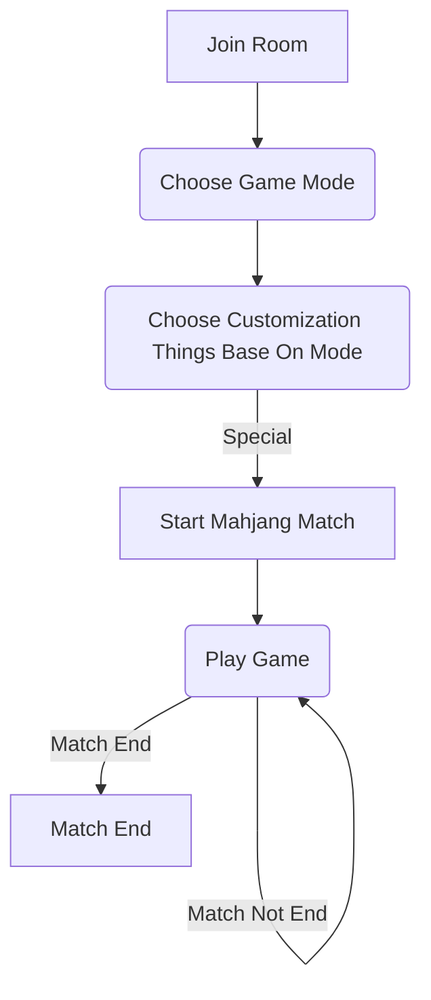

# Magic Mahjang GDD

## Information

|---|---|---|
|Game name| Magic Mahjang||
|Develop Platform| Unity||
|Develop Language| C#||
|Game Content|3D Model + 2D Scene| **TBD** |
|Target Platform|[Download Version] Steam (PC)||
|Category|Strategy|Board game|
|Art Style|Japan Anime||
|Player Numbers|1 ~ 4||
|Game Language|Chinese|English & Japanese|
|Games Ratings|ESRB - E(Everyone) | CERO[A]|
|Target Audience|All ages|
|Controller Support|Mouse & Keyboard|Gamepad|
|Game Mode|Single Player|Multiplayer|
|Steam Tag|single-player & LAN PvP & Cross-Platform Multiplayer|| 

## Game Pillars
1. Base on classic mahjang add different strategy element
2. Balance, Funny and Dramatic
3. Low-utilitarianism, Concise, Diverse game mode base on classic mahjang

## Player Experience
Choosing one of diverse skill to play mahjang with friends.

## Vision
Let players experience the fun of mahjang in a new way.

Magic Mahjang is a game that combines classic mahjang with different strategy elements. 
The game is designed to be fun and dramatic, with a variety of game modes to choose from. 
The game is aimed at players of all ages and skill levels, and is available in multiple languages. 
The game is designed to be easy to learn and play, with support for both keyboard and controller input.

## Unique Selling Proposition
1. Add more strategy elements, but all based on the classic mahjang rules, easy to learn and play
2. Opened game can let player community to create more game mode
3. Without gacha and in-game purchase system, Provide players with a pure gaming experience

## Background Settings
Cause of the game content, the background setting is now ellipsis.

## Core Gameplay


## Game Mechanics
### Core Mechanic
Cause of is mahjang game so **Mahjang** is the core mechanic.
### Mechanics
#### Character Skill
Principle : All Character skill.
```C#
Example : 
Character one : When a "Kan" is performed, if possible, you must 
draw a tile that can achieve "リンシャンカイホウ" 
//リンシャンカイホウ : Supplemental tile of melding quad
```
#### Cards _WIP_ _TBD_
```C#
Example :
Card one : When using this card, 
immediately draw two cards, and the next two draws are skipped.
```

## 3Cs
### Character
Magic Mahjang has a variety of characters to choose from, each with their own unique skills and abilities.
### Camera

<p>For Table : </p>
For Scene : 

TBD : Character has 3D Module
### Control


## Reference
### Game Reference
- [Mahjong Soul](https://mahjongsoul.yo-star.com/) : A popular online mahjong game.
- [Tenhou](https://tenhou.net/0/) : A Japanese popular online mahjong game.
- [Master Duel](https://store.steampowered.com/app/1449850/YuGiOh_Master_Duel/) : A popular online card game.
### Art Reference
- [Mahjong Soul](https://mahjongsoul.yo-star.com/) : Character design reference.
### Scene Reference
- [Tenhou](https://tenhou.net/0/) : Scene design reference.
### Sound Reference
### UI Reference
### Animation Reference

## Player Verb
### In-room Verb
1. Host Room
2. Join Room
3. Customize Game Mode
4. Ready Check
5. Start Game
6. Leave Room
7. Chat
8. Invite Friends
9. Kick Player
10. Block Player
### In-game Verb
1. Draw Pai
2. Discard Pai
3. Chi
4. Pon
5. Kan
6. AnKan
7. AddKan
8. Tsumo
9. Ron
10. Reach
11. Vote to End Game
12. Chat
13. Surrender and Leave Game